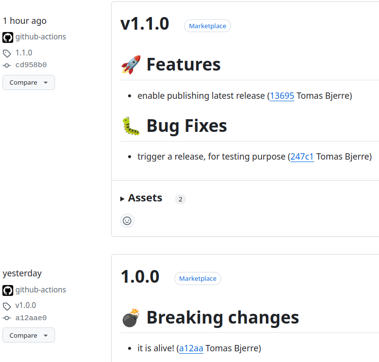

# Git Changelog Github Release Action

This is a
[GitHub action](https://docs.github.com/en/actions/creating-actions/about-custom-actions)
that can draft release in GitHub generated from template using
[git-changelog-lib](https://github.com/tomasbjerre/git-changelog-lib).

- You can have it running on your **default branch**, not depending on
  pull-requests.
- Uses **conventional commits** to keep a **draft release** updated and ready to
  be published.
  - It will parse any commit in branch and construct the **draft description**
    from that.
  - It will **adjust the draft version** based on conventional commits.

[<kbd></kbd>](git-changelog-github-release-draft.png)

## Draft releases

- Create a file, perhaps `.github/workflows/draft-release.yaml`, with content:

```yaml
name: Git Changelog Github Release

on: [workflow_dispatch, workflow_call, push]

jobs:
  build:
    runs-on: 'ubuntu-latest'
    steps:
      - uses: actions/checkout@v4
        with:
          fetch-tags: 'true'
          fetch-depth: '0'
      - name: Setup java
        uses: actions/setup-java@v2
        with:
          distribution: 'zulu'
          java-version: 17
      - uses: tomasbjerre/git-changelog-github-release@main
        env:
          # Needs write permission in Github menu '/settings/actions'
          GITHUB_TOKEN: ${{ secrets.GITHUB_TOKEN }}
```

Running example
[in this repo](https://github.com/tomasbjerre/.github/blob/master/.github/workflows/draft-release.yaml).

### Triggering release when publishing draft

You may want to have GitHub trigger a workflow when drafted release is
published. Perhaps to build it and upload a release. Perhaps something like
this:

```yaml
name: Release
on:
  release:
    types: [published]
jobs:
  publish:
    runs-on: ubuntu-latest
    permissions:
      contents: read
      packages: write
    steps:
      - name: Determine new version
        id: new_version
        run: |
          NEW_VERSION=$(echo "${GITHUB_REF}" | cut -d "/" -f3)
          echo "new_version=${NEW_VERSION}" >> $GITHUB_OUTPUT
      - name: Publish
        run:
          echo Whatever command to release version ${{
          steps.new_version.outputs.new_version }}
```

## Publish releases when tags pushed

If you already have some other way of releasing, you may want to just publish
those releases.

This will render the release content with the difference between the last 2
tags.

```yaml
name: Publish release on tag push

on:
  workflow_dispatch:
  workflow_call:
  push:
    tags:
      - '*'

jobs:
  build:
    runs-on: 'ubuntu-latest'
    permissions:
      contents: write
    steps:
      - uses: actions/checkout@v4
        with:
          fetch-tags: 'true'
          fetch-depth: '0'
      - name: Setup java
        uses: actions/setup-java@v2
        with:
          distribution: 'zulu'
          java-version: 17
      - uses: tomasbjerre/git-changelog-github-release@main
        env:
          # Needs write permission in Github menu '/settings/actions'
          GITHUB_TOKEN: ${{ secrets.GITHUB_TOKEN }}
        with:
          draft: false
```

Running example
[in this repo](https://github.com/tomasbjerre/.github/blob/master/.github/workflows/publish-release-on-tag-push.yaml).
